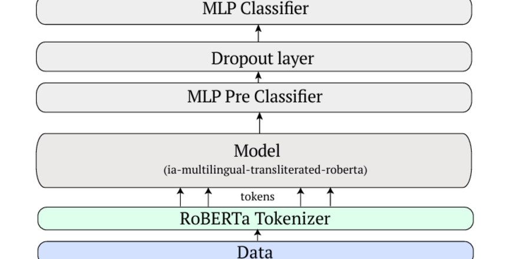

---

##### Download

+ [Paper](paper1.pdf)


---

##### Abstract

This work focuses on two subtasks related to hate speech detection and target identification in Devanagari-scripted languages, specifically Hindi, Marathi, Nepali, Bhojpuri, and Sanskrit. Subtask B involves detecting hate speech in online text, while Subtask C requires identifying the specific targets of hate speech, such as individuals, organizations, or communities. We propose the MultilingualRobertaClass model, a deep neural network built on the pretrained multilingual transformer model ia-multilingual-transliterated-roberta, optimized for classification tasks in multilingual and transliterated contexts. The model leverages contextualized embeddings to handle linguistic diversity, with a classifier head for binary classification. We received 88.40% accuracy in Subtask B and 66.11% accuracy in Subtask C, in the test set.

---

##### Figure 



---

##### Citation

Gupta, Siddhant; Singhal, Siddh; Wasi, Azmine Toushik. "Multilingual Hate Speech Detection and Target Identification in Devanagari-Scripted Languages." arXiv preprint arXiv:2412.17947, 2024.

```BibTeX
@article{arxiv2412.17947,
  author  = {Siddhant Gupta and Siddh Singhal and Azmine Toushik Wasi},  
  title   = {Multilingual Hate Speech Detection and Target Identification in Devanagari-Scripted Languages},  
  journal = {arXiv preprint},  
  year    = {2024},  
  eprint  = {2412.17947},  
  url     = {https://arxiv.org/abs/2412.17947}  
}
```

---


