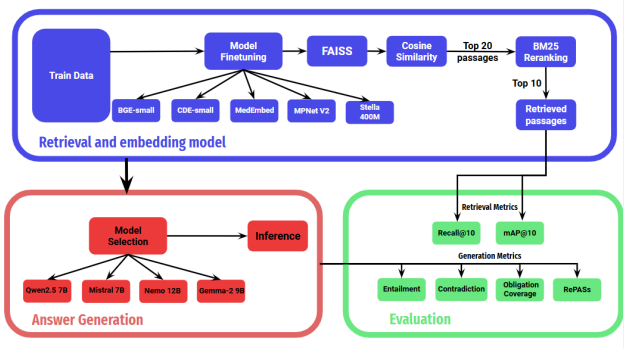

---

##### Download

+ [Paper](paper2.pdf)

---

##### Abstract

This paper presents the system description of our entry for the COLING 2025 RegNLP RIRAG (Regulatory Information Retrieval and Answer Generation) challenge, focusing on leveraging advanced information retrieval and answer generation techniques in regulatory domains. We experimented with a combination of embedding models, including Stella, BGE, CDE, and Mpnet, and leveraged fine-tuning and reranking for retrieving relevant documents in top ranks. We utilized a novel approach, LeSeR, which achieved competitive results with a recall@10 of 0.8201 and map@10 of 0.6655 for retrievals. This work highlights the transformative potential of natural language processing techniques in regulatory applications, offering insights into their capabilities for implementing a retrieval augmented generation system while identifying areas for future improvement in robustness and domain adaptation.

---

##### Figure 



---

##### Citation

Jebish Purbey, Drishti Sharma, Siddhant Gupta, Khawaja Murad, Siddartha Pullakhandam, Ram Mohan Rao Kadiyala. "1-800-SHARED-TASKS at RegNLP: Lexical Reranking of Semantic Retrieval (LeSeR) for Regulatory Question Answering" arXiv preprint arXiv:2412.00549 (2024).

```BibTeX
@article{Purbey2024,
author = {Jebish Purbey and Drishti Sharma and Siddhant Gupta and Khawaja Murad and Siddartha Pullakhandam and Ram Mohan Rao Kadiyala},
year = {2024},
title = {1-800-SHARED-TASKS at RegNLP: Lexical Reranking of Semantic Retrieval (LeSeR) for Regulatory Question Answering},
journal = {arXiv preprint},
volume = {arXiv:2412.00549}
}
```

---
